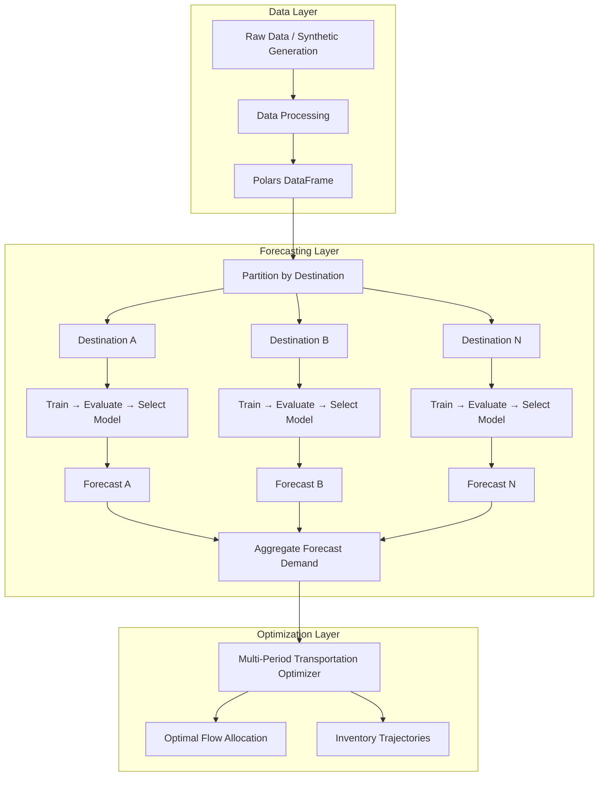

# Decision Intelligence Logistics Engine

An end-to-end decision system for logistics planning that combines demand forecasting, stochastic simulation, and network optimization.

The project is designed to showcase production-oriented applied science and engineering skills at the intersection of:

- Operations Research
- Machine Learning
- Data Engineering
- MLOps
- API-based deployment

## Project Goal

Build a scalable logistics decision engine that can:

1. Generate or ingest historical shipment and demand data
2. Forecast future demand — independently per destination
3. Simulate uncertain logistics scenarios
4. Optimize origin-destination flows under capacity and cost constraints
5. Expose the full pipeline through an API

This repository reflects how real-world planning systems are built: not only with mathematical models, but also with robust data pipelines, modular software design, and deployable services.

---

## Architecture



### Per-Destination Forecasting Pipeline

The forecasting system uses a **local model architecture**: each destination gets its own independently trained, evaluated, and selected model. This captures local demand patterns (seasonality, trend, volatility) that a single global model cannot.

```
Input DataFrame (date, destination_id, demand)
    │
    ├── Partition by destination_id
    │
    ├── For each destination (parallelizable):
    │   ├── Sort by date
    │   ├── Split train/test (chronological)
    │   ├── For each model in registry:
    │   │   ├── Fit on train
    │   │   ├── Predict on test
    │   │   └── Evaluate (WAPE, MAE, RMSE, MAPE, MSE)
    │   └── Select best model (minimize configurable metric)
    │
    └── Aggregate results → AggregatedForecastingResult
```

### Optimization Layer: Multi-Period Transportation Optimization

The optimization layer solves a minimum-cost, multi-period transportation problem with inventory tracking — answering: *"Over the next N days, how should we ship and store inventory to minimize total cost?"*

```
Inputs:
  - demand_ts:        [destination_id, date, demand]   (time-indexed demand)
  - origins_df:       [origin_id, daily_capacity]
  - lanes_df:         [origin_id, destination_id, unit_cost]
  - destinations_df:  [destination_id, holding_cost]
  - planning_horizon: [date_1, date_2, ..., date_T]
  - initial_inventory: {destination_id: quantity}

Objective: minimize Σ unit_cost(o,d) × flow(o,d,t) + Σ holding_cost(d) × inventory(d,t)
Subject to:
  - Inventory balance: inv(d,t) = inv(d,t-1) + inflow(d,t) - demand(d,t)
  - Capacity limits:   Σ_d flow(o,d,t) ≤ capacity(o)   ∀ origins, periods
  - Non-negativity:    flow(o,d,t) ≥ 0, inv(d,t) ≥ 0

Output: MultiPeriodResult (time-indexed flows + inventory levels + total_cost)
```

`MultiPeriodOptimizer` jointly optimizes across the entire planning horizon, trading off shipping costs against holding costs and anticipating future demand. It is implemented as the `src/optimization/multi_period/` package:

- `optimizer.py` — `MultiPeriodOptimizer` (orchestrates the steps below)
- `validation.py` — input validation and pre-solve feasibility checks
- `preprocessing.py` — demand time series preprocessing
- `model_builder.py` — LP variable/constraint/objective construction
- `solution_extractor.py` — extracts flows and inventory from the solved LP
- `result.py` — `MultiPeriodResult` dataclass

---

## Core Components

### 1. Data Layer
- Synthetic logistics data generation (`scripts/generate_data.py`, also used to populate `experiments/datasets/`)
- Data processing with Polars via module-level validation functions
- Efficient storage in Parquet format
- Explicit `__all__` exports in all packages

### 2. Forecasting Layer
- **Per-destination model training** — one model per destination, independently selected
- **Model Registry** — factory pattern for dynamic model instantiation
- **Unified ModelSelector** — selects best model by configurable metric from `(name, metrics)` tuples, with NaN handling and first-in-order tiebreaking
- **Supported models**: Naive, Seasonal Naive, Rolling Window (Moving Average), ETS, SARIMAX
- **Evaluation**: WAPE, MAE, RMSE, MAPE, MSE per destination per model (pure, side-effect-free)
- **Model selection**: automatic best-model selection per destination by configurable metric
- **Pipeline Protocol**: `ForecastingPipelineProtocol` (structural subtyping via `@runtime_checkable Protocol`) — `PerDestinationForecastingPipeline` conforms
- **Parallel execution**: joblib-based parallelism across destinations (configurable workers)
- **Fault tolerance**: individual destination failures don't block the pipeline
- **Reproducibility**: deterministic results regardless of row ordering or parallelism level

### 3. Optimization Layer
- **Multi-period**: joint optimization over a planning horizon with inventory tracking and holding costs
- `MultiPeriodOptimizer` (`src/optimization/multi_period/`) split into validation, preprocessing, model-building, and solution-extraction submodules
- **Shared validation module** (`optimization.validation`) — common checks reused by the multi-period validation layer
- OR-Tools backend (GLOP for LP, CBC for MIP)
- Capacity-constrained origin-to-destination flow assignment
- Pre-solve feasibility checks (unreachable destinations, insufficient capacity, negative costs, non-positive capacities)
- Integration of forecast-derived demand into downstream optimization

### 4. Simulation Layer *(interface defined)*
- `SimulationInterface` ABC with `SimulationResult` dataclass
- Ready for event-driven simulation of shipment arrivals, delays, and processing
- Stochastic demand generation
- Scenario analysis under uncertainty

### 5. Experiment Infrastructure
- Named experiment configs in `experiments/configs/` (YAML-driven, validated against `PerDestinationConfig`)
- Versioned dataset committed to git (`experiments/datasets/synthetic_v1/`)
- `run_experiment.py` — runs one experiment end-to-end and saves 5 artifacts (`metrics.json`, `forecasts.parquet`, `flows.parquet`, `inventory.parquet`, `config.yaml`)
- `run_all.py` — batch runner across all experiment configs with a summary table

### 6. Serving Layer
- FastAPI application with `/forecast`, `/optimize`, and `/plan` endpoints
- `APIInterface` ABC decouples the HTTP layer from the forecasting and optimization engines
- `LogisticsAPI` concrete implementation wiring `PerDestinationForecastingPipeline` and `MultiPeriodOptimizer`
- Pydantic request/response models for automatic JSON validation and serialization

---

## Tech Stack

| Category | Tools |
|----------|-------|
| Language | Python 3.11+ |
| DataFrames | Polars |
| Optimization | OR-Tools (GLOP, CBC) |
| Statistical Models | statsmodels (ETS, ARIMA) |
| Metrics | scikit-learn |
| Parallelism | joblib |
| Numerics | NumPy |
| Visualization | Matplotlib |
| Configuration | PyYAML |
| Testing | pytest, Hypothesis (property-based testing) |
| API | FastAPI, Uvicorn |

---

---

## Quick Start

```bash
# Clone and setup
git clone https://github.com/<your-username>/decision-intelligence-logistics-engine.git
cd decision-intelligence-logistics-engine
python -m venv .venv
source .venv/bin/activate
pip install -r requirements.txt

# Run the full pipeline demo
python scripts/example_end_to_end_pipeline.py

# Run tests
python -m pytest tests/ -v
```

---

## Running the API

Make sure dependencies are installed, then start the server:

```bash
PYTHONPATH=src uvicorn api.app:app --reload
```

The server will be available at `http://localhost:8000`.

### Interactive docs (Swagger UI)

Open `http://localhost:8000/docs` in your browser. FastAPI generates a full interactive interface where you can explore all endpoints, inspect request/response schemas, and send requests directly.

### Endpoints

| Method | Path | Description |
|--------|------|-------------|
| `GET` | `/health` | Liveness check |
| `POST` | `/forecast` | Per-destination demand forecasting |
| `POST` | `/optimize` | Multi-period min-cost flow optimization |
| `POST` | `/plan` | Full pipeline: forecast → optimize in one call |

### Example: `/health`

```bash
curl http://localhost:8000/health
# {"status":"ok"}
```

### Example: `/plan`

```bash
curl -X POST http://localhost:8000/plan \
  -H "Content-Type: application/json" \
  -d '{
    "demand_history": [
      {"date":"2026-06-01","destination_id":"D1","demand":100},
      {"date":"2026-06-02","destination_id":"D1","demand":105},
      {"date":"2026-06-03","destination_id":"D1","demand":110},
      {"date":"2026-06-04","destination_id":"D1","demand":115},
      {"date":"2026-06-05","destination_id":"D1","demand":120},
      {"date":"2026-06-06","destination_id":"D1","demand":125},
      {"date":"2026-06-07","destination_id":"D1","demand":130},
      {"date":"2026-06-08","destination_id":"D1","demand":135},
      {"date":"2026-06-09","destination_id":"D1","demand":140},
      {"date":"2026-06-10","destination_id":"D1","demand":145},
      {"date":"2026-06-01","destination_id":"D2","demand":50},
      {"date":"2026-06-02","destination_id":"D2","demand":55},
      {"date":"2026-06-03","destination_id":"D2","demand":60},
      {"date":"2026-06-04","destination_id":"D2","demand":65},
      {"date":"2026-06-05","destination_id":"D2","demand":70},
      {"date":"2026-06-06","destination_id":"D2","demand":75},
      {"date":"2026-06-07","destination_id":"D2","demand":80},
      {"date":"2026-06-08","destination_id":"D2","demand":85},
      {"date":"2026-06-09","destination_id":"D2","demand":90},
      {"date":"2026-06-10","destination_id":"D2","demand":95}
    ],
    "origins": [
      {"origin_id":"O1","daily_capacity":200},
      {"origin_id":"O2","daily_capacity":200}
    ],
    "lanes": [
      {"origin_id":"O1","destination_id":"D1","unit_cost":1},
      {"origin_id":"O1","destination_id":"D2","unit_cost":10},
      {"origin_id":"O2","destination_id":"D1","unit_cost":10},
      {"origin_id":"O2","destination_id":"D2","unit_cost":1}
    ],
    "destinations": [
      {"destination_id":"D1"},
      {"destination_id":"D2"}
    ],
    "model_names": ["naive_forecaster"],
    "train_ratio": 0.8,
    "selection_metric": "wape",
    "max_workers": 1,
    "minimum_history_length": 10,
    "random_seed": 42,
    "model_params": {},
    "initial_inventory": {}
  }'
```

---
## Example Output

The `/plan` endpoint executes the complete decision pipeline:

```text
Historical Demand
        ↓
Forecasting
        ↓
Demand Forecast
        ↓
Network Optimization
        ↓
Shipment Plan
```

Example response:

```json
{
  "forecast": {
    "successful": [
      {
        "destination_id": "D1",
        "best_model": "naive_forecaster",
        "forecast": 140,
        "wape": 0.034
      },
      {
        "destination_id": "D2",
        "best_model": "naive_forecaster",
        "forecast": 90,
        "wape": 0.053
      }
    ]
  },
  "optimization": {
    "total_cost": 230,
    "flows": [
      {
        "origin_id": "O1",
        "destination_id": "D1",
        "flow": 140
      },
      {
        "origin_id": "O2",
        "destination_id": "D2",
        "flow": 90
      }
    ]
  }
}
```

In this example:

* Destination **D1** receives a forecast demand of **140 units**
* Destination **D2** receives a forecast demand of **90 units**
* The optimizer routes each destination through its lowest-cost origin
* All demand is satisfied while minimizing transportation cost
* The resulting shipment plan has a total logistics cost of **230**

This demonstrates the complete decision workflow: demand forecasting, model selection, forecast extraction, 
and cost-optimal network planning in a single API call.

---
## Testing

The project uses **pytest** with **Hypothesis** for property-based testing:

```bash
python -m pytest tests/ -v
# 162 passed
```

Key correctness properties verified:
- Data isolation between destinations
- Temporal split correctness (no future leakage)
- Row-order independence
- Model selection minimality with tiebreaking
- Fault tolerance completeness
- Determinism across executions
- Pipeline protocol conformance

---

## Planned Features

- [x] FastAPI endpoints for end-to-end execution (`/forecast`, `/optimize`, `/plan`)
- [ ] Stochastic simulation layer implementation (interface defined via `SimulationInterface`)
- [ ] MLflow experiment tracking
- [ ] Docker support
- [ ] ML model integration (LightGBM, XGBoost, Prophet)
- [ ] Hierarchical forecasting
- [ ] Performance benchmarking
- [ ] Visualization config support (show/save via YAML)

---

## Author

**Christian Piermarini**
Applied Scientist / Operations Research / Machine Learning
