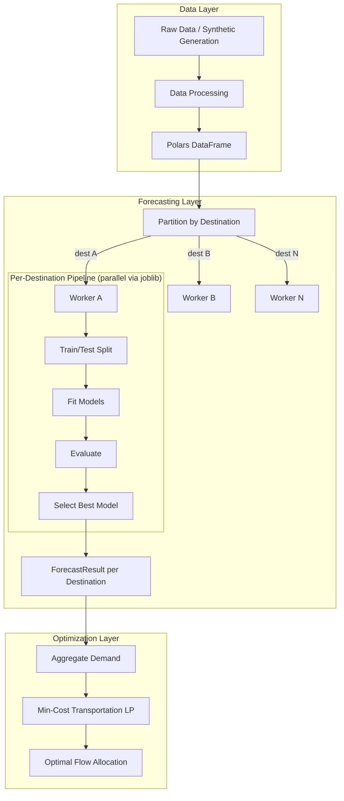

# Decision Intelligence Logistics Engine

An end-to-end decision system for logistics planning that combines demand forecasting, stochastic simulation, and network optimization.

The project is designed to showcase production-oriented applied science and engineering skills at the intersection of:

- Operations Research
- Machine Learning
- Data Engineering
- MLOps
- API-based deployment

## Project Goal

Build a scalable logistics decision engine that can:

1. Generate or ingest historical shipment and demand data
2. Forecast future demand — independently per destination
3. Simulate uncertain logistics scenarios
4. Optimize origin-destination flows under capacity and cost constraints
5. Expose the full pipeline through an API

This repository reflects how real-world planning systems are built: not only with mathematical models, but also with robust data pipelines, modular software design, and deployable services.

---

## Architecture



### Per-Destination Forecasting Pipeline

The forecasting system uses a **local model architecture**: each destination gets its own independently trained, evaluated, and selected model. This captures local demand patterns (seasonality, trend, volatility) that a single global model cannot.

```
Input DataFrame (date, destination_id, demand)
    │
    ├── Partition by destination_id
    │
    ├── For each destination (parallelizable):
    │   ├── Sort by date
    │   ├── Split train/test (chronological)
    │   ├── For each model in registry:
    │   │   ├── Fit on train
    │   │   ├── Predict on test
    │   │   └── Evaluate (WAPE, MAE, RMSE, MAPE, MSE)
    │   └── Select best model (minimize configurable metric)
    │
    └── Aggregate results → AggregatedPipelineResult
```

---

## Core Components

### 1. Data Layer
- Synthetic logistics data generation
- Data processing with Polars
- Efficient storage in Parquet format

### 2. Forecasting Layer
- **Per-destination model training** — one model per destination, independently selected
- **Model Registry** — factory pattern for dynamic model instantiation
- **Supported models**: Naive, Seasonal Naive, Rolling Window (Moving Average), ETS, ARIMA/SARIMAX
- **Evaluation**: WAPE, MAE, RMSE, MAPE, MSE per destination per model
- **Model selection**: automatic best-model selection per destination by configurable metric
- **Parallel execution**: joblib-based parallelism across destinations (configurable workers)
- **Fault tolerance**: individual destination failures don't block the pipeline
- **Reproducibility**: deterministic results regardless of row ordering or parallelism level
- **Persistence interface**: abstract storage layer (ready for S3, database, filesystem)

### 3. Optimization Layer
- Minimum-cost transportation LP using OR-Tools (GLOP / CBC solvers)
- Multi-period optimization with inventory tracking
- Capacity-constrained origin-to-destination flow assignment
- Input validation with pre-solve feasibility checks
- Integration of forecast-derived demand into downstream optimization

### 4. Simulation Layer *(planned)*
- Event-driven simulation of shipment arrivals, delays, and processing
- Stochastic demand generation
- Scenario analysis under uncertainty

### 5. Serving Layer *(planned)*
- FastAPI endpoints for simulation, forecasting, and optimization

---

## Tech Stack

| Category | Tools |
|----------|-------|
| Language | Python 3.11+ |
| DataFrames | Polars |
| Optimization | OR-Tools (GLOP, CBC) |
| Statistical Models | statsmodels (ETS, ARIMA) |
| Metrics | scikit-learn |
| Parallelism | joblib |
| Numerics | NumPy |
| Visualization | Matplotlib |
| Configuration | PyYAML |
| Testing | pytest, Hypothesis (property-based testing) |

---

## Repository Structure

```text
decision-intelligence-logistics-engine/
│
├── configs/                    # YAML configuration files
├── data/                       # parquet files and output
├── notebooks/                  # exploratory analysis
├── scripts/
│   └── example_end_to_end_pipeline.py  # runnable demo
│
├── src/
│   ├── data/
│   │   ├── ingestion.py
│   │   ├── input_data.py
│   │   └── processing/
│   │
│   ├── forecasting/
│   │   ├── models/             # BaseForecaster + concrete models
│   │   │   ├── base_forecaster.py
│   │   │   ├── naive_forecaster.py
│   │   │   ├── seasonal_forecaster.py
│   │   │   ├── rolling_window_forecaster.py
│   │   │   ├── ets_forecaster.py
│   │   │   └── sarimax_forecaster.py
│   │   ├── registry/           # Model registry + default setup
│   │   │   ├── model_registry.py
│   │   │   └── default_registry.py
│   │   ├── evaluation/         # Metrics + model selection
│   │   │   ├── evaluator.py
│   │   │   ├── model_selector.py
│   │   │   └── per_destination_model_selector.py
│   │   ├── pipeline/           # Orchestration
│   │   │   ├── pipeline.py
│   │   │   ├── per_destination_pipeline.py
│   │   │   └── pipeline_factory.py
│   │   ├── persistence/        # Storage abstraction
│   │   │   ├── persistence.py
│   │   │   └── in_memory_persistence.py
│   │   └── results/            # Data objects
│   │       ├── forecast_result.py
│   │       └── forecast_extractor.py
│   │
│   ├── optimization/
│   │   ├── optimizer.py
│   │   ├── multi_period_optimizer.py
│   │   ├── multi_period_result.py
│   │   └── optimizer_interface.py
│   │
│   ├── postprocessing/
│   │   ├── metrics_summary.py
│   │   └── visualization.py
│   │
│   └── utils/
│       ├── config.py
│       └── system_paths.py
│
├── tests/                      # 182 tests (unit + property-based)
├── pyproject.toml
├── requirements.txt
└── README.md
```

---

## Quick Start

```bash
# Clone and setup
git clone https://github.com/<your-username>/decision-intelligence-logistics-engine.git
cd decision-intelligence-logistics-engine
python -m venv .venv
source .venv/bin/activate
pip install -r requirements.txt

# Run the full pipeline demo
python scripts/example_end_to_end_pipeline.py

# Run tests
python -m pytest tests/ -v
```

---

## Example Output

Running the per-destination pipeline on synthetic data with 4 destinations:

```
Destination D01  -> Best model: seasonal_forecaster  (WAPE: 0.027)
Destination D02  -> Best model: ma_7_forecaster      (WAPE: 0.063)
Destination D03  -> Best model: ma_7_forecaster      (WAPE: 0.180)
Destination D04  -> Best model: ma_7_forecaster      (WAPE: 0.067)
```

Each destination independently selects the model best suited to its demand pattern.

---

## Design Principles

- **Explicit destination isolation** — no data leakage between destinations
- **No global model selection** — each destination has its own best model
- **Row-order independence** — results are deterministic regardless of input ordering
- **Fault tolerance** — one destination's failure doesn't block others
- **Open-closed architecture** — add new models (LightGBM, Prophet, DeepAR) without modifying pipeline code
- **Property-based testing** — 13 formal correctness properties verified with Hypothesis

---

## Testing

The project uses **pytest** with **Hypothesis** for property-based testing:

```bash
python -m pytest tests/ -v
# 182 passed
```

Key correctness properties verified:
- Data isolation between destinations
- Temporal split correctness (no future leakage)
- Row-order independence
- Model selection minimality with tiebreaking
- Fault tolerance completeness
- Determinism across executions

---

## Planned Features

- [ ] FastAPI endpoints for end-to-end execution
- [ ] MLflow experiment tracking
- [ ] Docker support
- [ ] Stochastic simulation layer (SimPy)
- [ ] ML model integration (LightGBM, XGBoost, Prophet)
- [ ] Hierarchical forecasting
- [ ] Performance benchmarking

---

## Author

**Christian Piermarini**
Applied Scientist / Operations Research / Machine Learning
