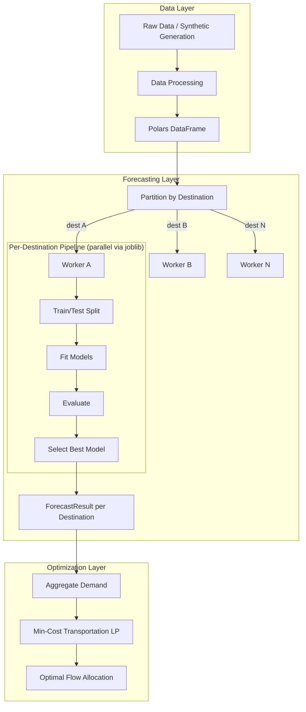

# Decision Intelligence Logistics Engine

An end-to-end decision system for logistics planning that combines demand forecasting, stochastic simulation, and network optimization.

The project is designed to showcase production-oriented applied science and engineering skills at the intersection of:

- Operations Research
- Machine Learning
- Data Engineering
- MLOps
- API-based deployment

## Project Goal

Build a scalable logistics decision engine that can:

1. Generate or ingest historical shipment and demand data
2. Forecast future demand — independently per destination
3. Simulate uncertain logistics scenarios
4. Optimize origin-destination flows under capacity and cost constraints
5. Expose the full pipeline through an API

This repository reflects how real-world planning systems are built: not only with mathematical models, but also with robust data pipelines, modular software design, and deployable services.

---

## Architecture



### Per-Destination Forecasting Pipeline

The forecasting system uses a **local model architecture**: each destination gets its own independently trained, evaluated, and selected model. This captures local demand patterns (seasonality, trend, volatility) that a single global model cannot.

```
Input DataFrame (date, destination_id, demand)
    │
    ├── Partition by destination_id
    │
    ├── For each destination (parallelizable):
    │   ├── Sort by date
    │   ├── Split train/test (chronological)
    │   ├── For each model in registry:
    │   │   ├── Fit on train
    │   │   ├── Predict on test
    │   │   └── Evaluate (WAPE, MAE, RMSE, MAPE, MSE)
    │   └── Select best model (minimize configurable metric)
    │
    └── Aggregate results → AggregatedPipelineResult
```

### Optimization Layer: Single-Period vs Multi-Period

The optimization layer solves minimum-cost transportation problems to allocate supply from origins to destinations. It supports two modes through a unified `OptimizerInterface`:

**Single-Period Optimization** — answers: *"Given today's demand, how should we allocate supply right now?"*

```
Inputs:
  - demand_df:  [destination_id, demand]         (point-in-time demand)
  - origins_df: [origin_id, daily_capacity]
  - lanes_df:   [origin_id, destination_id, unit_cost]

Objective: minimize Σ unit_cost(o,d) × flow(o,d)
Subject to:
  - Demand satisfaction:  Σ_o flow(o,d) ≥ demand(d)     ∀ destinations
  - Capacity limits:      Σ_d flow(o,d) ≤ capacity(o)   ∀ origins
  - Non-negativity:       flow(o,d) ≥ 0

Output: OptimizationResult (flows + total_cost)
```

**Multi-Period Optimization** — answers: *"Over the next N days, how should we ship and store inventory to minimize total cost?"*

```
Inputs:
  - demand_ts:        [destination_id, date, demand]   (time-indexed demand)
  - origins_df:       [origin_id, daily_capacity]
  - lanes_df:         [origin_id, destination_id, unit_cost]
  - destinations_df:  [destination_id, holding_cost]
  - planning_horizon: [date_1, date_2, ..., date_T]
  - initial_inventory: {destination_id: quantity}

Objective: minimize Σ unit_cost(o,d) × flow(o,d,t) + Σ holding_cost(d) × inventory(d,t)
Subject to:
  - Inventory balance: inv(d,t) = inv(d,t-1) + inflow(d,t) - demand(d,t)
  - Capacity limits:   Σ_d flow(o,d,t) ≤ capacity(o)   ∀ origins, periods
  - Non-negativity:    flow(o,d,t) ≥ 0, inv(d,t) ≥ 0

Output: MultiPeriodResult (time-indexed flows + inventory levels + total_cost)
```

The key difference: single-period treats each day independently (myopic), while multi-period jointly optimizes across the entire horizon, trading off shipping costs against holding costs and anticipating future demand.

---

## Core Components

### 1. Data Layer
- Synthetic logistics data generation (dedicated `scripts/synthetic_data.py` module)
- Data processing with Polars via module-level validation functions
- Efficient storage in Parquet format
- Explicit `__all__` exports in all packages

### 2. Forecasting Layer
- **Per-destination model training** — one model per destination, independently selected
- **Model Registry** — factory pattern for dynamic model instantiation
- **Unified ModelSelector** — single implementation supporting both DataFrame and tuple-list inputs, with NaN handling and first-in-order tiebreaking
- **Supported models**: Naive, Seasonal Naive, Rolling Window (Moving Average), ETS, ARIMA/SARIMAX
- **Evaluation**: WAPE, MAE, RMSE, MAPE, MSE per destination per model (pure, side-effect-free)
- **Model selection**: automatic best-model selection per destination by configurable metric
- **Pipeline Protocol**: `PipelineProtocol` (structural subtyping) — both `ForecastingPipeline` and `PerDestinationPipeline` conform
- **Parallel execution**: joblib-based parallelism across destinations (configurable workers)
- **Fault tolerance**: individual destination failures don't block the pipeline
- **Reproducibility**: deterministic results regardless of row ordering or parallelism level
- **Persistence interface**: abstract storage layer (ready for S3, database, filesystem)

### 3. Optimization Layer
- **Single-period**: minimum-cost transportation LP — allocate supply to meet demand now
- **Multi-period**: joint optimization over a planning horizon with inventory tracking and holding costs
- Unified `OptimizerInterface` dispatches to the appropriate solver mode
- **Shared validation module** (`optimization.validation`) — common checks used by both optimizers
- OR-Tools backend (GLOP for LP, CBC for MIP)
- Capacity-constrained origin-to-destination flow assignment
- Pre-solve feasibility checks (unreachable destinations, insufficient capacity, negative costs, non-positive capacities)
- Integration of forecast-derived demand into downstream optimization

### 4. Simulation Layer *(interface defined)*
- `SimulationInterface` ABC with `SimulationResult` dataclass
- Ready for event-driven simulation of shipment arrivals, delays, and processing
- Stochastic demand generation
- Scenario analysis under uncertainty

### 5. Serving Layer *(interface defined)*
- `APIInterface` ABC with `forecast` and `optimize` abstract methods
- Ready for FastAPI endpoints for simulation, forecasting, and optimization

---

## Tech Stack

| Category | Tools |
|----------|-------|
| Language | Python 3.11+ |
| DataFrames | Polars |
| Optimization | OR-Tools (GLOP, CBC) |
| Statistical Models | statsmodels (ETS, ARIMA) |
| Metrics | scikit-learn |
| Parallelism | joblib |
| Numerics | NumPy |
| Visualization | Matplotlib |
| Configuration | PyYAML |
| Testing | pytest, Hypothesis (property-based testing) |
| API | FastAPI, Uvicorn |

---

---

## Quick Start

```bash
# Clone and setup
git clone https://github.com/<your-username>/decision-intelligence-logistics-engine.git
cd decision-intelligence-logistics-engine
python -m venv .venv
source .venv/bin/activate
pip install -r requirements.txt

# Run the full pipeline demo
python scripts/example_end_to_end_pipeline.py

# Run tests
python -m pytest tests/ -v
```

---

## Running the API

Make sure dependencies are installed, then start the server:

```bash
PYTHONPATH=src uvicorn api.app:app --reload
```

The server will be available at `http://localhost:8000`.

### Interactive docs (Swagger UI)

Open `http://localhost:8000/docs` in your browser. FastAPI generates a full interactive interface where you can explore all endpoints, inspect request/response schemas, and send requests directly.

### Endpoints

| Method | Path | Description |
|--------|------|-------------|
| `GET` | `/health` | Liveness check |
| `POST` | `/forecast` | Per-destination demand forecasting |
| `POST` | `/optimize` | Multi-period min-cost flow optimization |
| `POST` | `/plan` | Full pipeline: forecast → optimize in one call |

### Example: `/health`

```bash
curl http://localhost:8000/health
# {"status":"ok"}
```

### Example: `/forecast`

```bash
curl -X POST http://localhost:8000/forecast \
  -H "Content-Type: application/json" \
  -d '{
    "demand_history": [
      {"date": "2026-06-01", "destination_id": "D1", "demand": 100},
      {"date": "2026-06-02", "destination_id": "D1", "demand": 105},
      {"date": "2026-06-03", "destination_id": "D1", "demand": 98},
      {"date": "2026-06-04", "destination_id": "D1", "demand": 110},
      {"date": "2026-06-05", "destination_id": "D1", "demand": 115},
      {"date": "2026-06-06", "destination_id": "D1", "demand": 120},
      {"date": "2026-06-07", "destination_id": "D1", "demand": 118},
      {"date": "2026-06-08", "destination_id": "D1", "demand": 125},
      {"date": "2026-06-09", "destination_id": "D1", "demand": 130},
      {"date": "2026-06-10", "destination_id": "D1", "demand": 128}
    ],
    "model_names": ["naive_forecaster", "seasonal_forecaster", "rolling_window_forecaster"],
    "train_ratio": 0.8,
    "selection_metric": "wape",
    "max_workers": 1,
    "minimum_history_length": 10,
    "random_seed": 42,
    "model_params": {}
  }'
```

### Example: `/plan`

```bash
curl -X POST http://localhost:8000/plan \
  -H "Content-Type: application/json" \
  -d '{
    "demand_history": [
      {"date": "2026-06-01", "destination_id": "D1", "demand": 100},
      {"date": "2026-06-02", "destination_id": "D1", "demand": 105},
      {"date": "2026-06-03", "destination_id": "D1", "demand": 98},
      {"date": "2026-06-04", "destination_id": "D1", "demand": 110},
      {"date": "2026-06-05", "destination_id": "D1", "demand": 115},
      {"date": "2026-06-06", "destination_id": "D1", "demand": 120},
      {"date": "2026-06-07", "destination_id": "D1", "demand": 118},
      {"date": "2026-06-08", "destination_id": "D1", "demand": 125},
      {"date": "2026-06-09", "destination_id": "D1", "demand": 130},
      {"date": "2026-06-10", "destination_id": "D1", "demand": 128}
    ],
    "origins": [
      {"origin_id": "O1", "daily_capacity": 200.0},
      {"origin_id": "O2", "daily_capacity": 150.0}
    ],
    "lanes": [
      {"origin_id": "O1", "destination_id": "D1", "unit_cost": 1.5},
      {"origin_id": "O2", "destination_id": "D1", "unit_cost": 2.0}
    ],
    "destinations": [
      {"destination_id": "D1"}
    ],
    "model_names": ["naive_forecaster", "seasonal_forecaster", "rolling_window_forecaster"],
    "train_ratio": 0.8,
    "selection_metric": "wape",
    "max_workers": 1,
    "minimum_history_length": 10,
    "random_seed": 42,
    "model_params": {},
    "initial_inventory": {"D1": 50.0}
  }'
```

---

## Example Output

Running the per-destination pipeline on synthetic data with 4 destinations:

```
Destination D01  -> Best model: seasonal_forecaster  (WAPE: 0.027)
Destination D02  -> Best model: ma_7_forecaster      (WAPE: 0.063)
Destination D03  -> Best model: ma_7_forecaster      (WAPE: 0.180)
Destination D04  -> Best model: ma_7_forecaster      (WAPE: 0.067)
```

Each destination independently selects the model best suited to its demand pattern.

---

## Design Principles

- **Explicit destination isolation** — no data leakage between destinations
- **No global model selection** — each destination has its own best model
- **Row-order independence** — results are deterministic regardless of input ordering
- **Fault tolerance** — one destination's failure doesn't block others
- **Open-closed architecture** — add new models (LightGBM, Prophet, DeepAR) without modifying pipeline code
- **Composition over inheritance** — module-level functions and protocols over deep class hierarchies
- **Explicit contracts** — `Protocol`, `ABC`, and `__all__` declare what is public
- **Pure functions where possible** — no hidden state mutation during computation
- **Property-based testing** — 13 formal correctness properties verified with Hypothesis

---

## Testing

The project uses **pytest** with **Hypothesis** for property-based testing:

```bash
python -m pytest tests/ -v
# 188 passed
```

Key correctness properties verified:
- Data isolation between destinations
- Temporal split correctness (no future leakage)
- Row-order independence
- Model selection minimality with tiebreaking
- Fault tolerance completeness
- Determinism across executions
- Pipeline protocol conformance

---

## Planned Features

- [x] FastAPI endpoints for end-to-end execution (`/forecast`, `/optimize`, `/plan`)
- [ ] Stochastic simulation layer implementation (interface defined via `SimulationInterface`)
- [ ] MLflow experiment tracking
- [ ] Docker support
- [ ] ML model integration (LightGBM, XGBoost, Prophet)
- [ ] Hierarchical forecasting
- [ ] Performance benchmarking
- [ ] Visualization config support (show/save via YAML)

---

## Author

**Christian Piermarini**
Applied Scientist / Operations Research / Machine Learning
