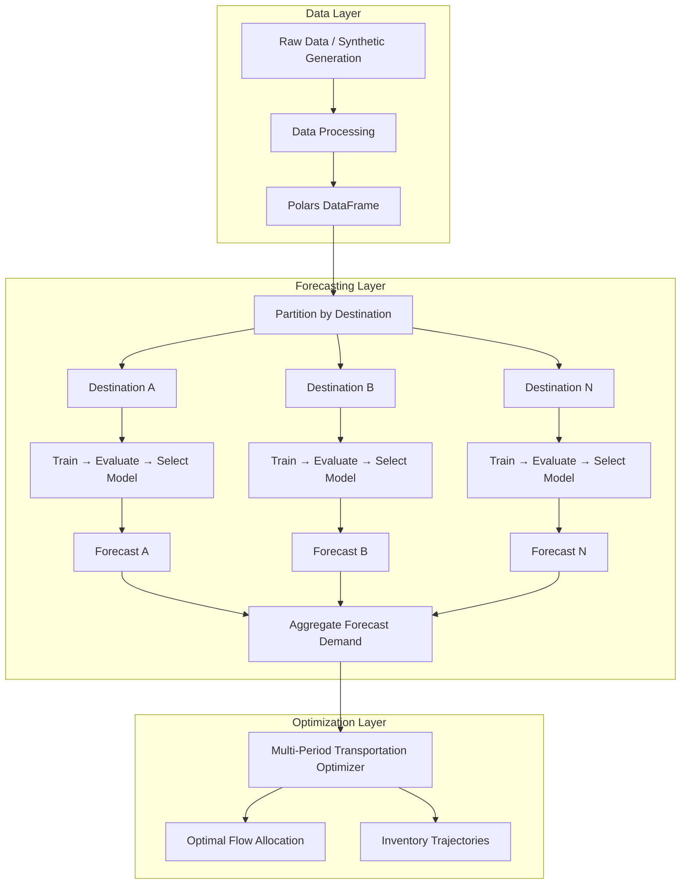

# Architecture

## System Overview



## Per-Destination Forecasting Pipeline

The forecasting system uses a **local model architecture**: each destination gets its own independently trained, evaluated, and selected model. This captures local demand patterns (seasonality, trend, volatility) that a single global model cannot.

```
Input DataFrame (date, destination_id, demand)
    │
    ├── Partition by destination_id
    │
    ├── For each destination (parallelizable):
    │   ├── Sort by date
    │   ├── Split train/test (chronological)
    │   ├── For each model in registry:
    │   │   ├── Fit on train
    │   │   ├── Predict on test
    │   │   └── Evaluate (WAPE, MAE, RMSE, MAPE, MSE)
    │   └── Select best model (minimize configurable metric)
    │
    └── Aggregate results → AggregatedForecastingResult
```

## Optimization Layer: Multi-Period Transportation Optimization

The optimization layer solves a minimum-cost, multi-period transportation problem with inventory tracking — answering: *"Over the next N days, how should we ship and store inventory to minimize total cost?"*

```
Inputs:
  - demand_ts:        [destination_id, date, demand]   (time-indexed demand)
  - origins_df:       [origin_id, daily_capacity]
  - lanes_df:         [origin_id, destination_id, unit_cost]
  - destinations_df:  [destination_id, holding_cost]
  - planning_horizon: [date_1, date_2, ..., date_T]
  - initial_inventory: {destination_id: quantity}

Objective: minimize Σ unit_cost(o,d) × flow(o,d,t) + Σ holding_cost(d) × inventory(d,t)
Subject to:
  - Inventory balance: inv(d,t) = inv(d,t-1) + inflow(d,t) - demand(d,t)
  - Capacity limits:   Σ_d flow(o,d,t) ≤ capacity(o)   ∀ origins, periods
  - Non-negativity:    flow(o,d,t) ≥ 0, inv(d,t) ≥ 0

Output: MultiPeriodResult (time-indexed flows + inventory levels + total_cost)
```

`MultiPeriodOptimizer` jointly optimizes across the entire planning horizon, trading off shipping costs against holding costs and anticipating future demand. It is implemented as the `src/optimization/multi_period/` package:

- `optimizer.py` — `MultiPeriodOptimizer` (orchestrates the steps below)
- `validation.py` — input validation and pre-solve feasibility checks
- `preprocessing.py` — demand time series preprocessing
- `model_builder.py` — LP variable/constraint/objective construction
- `solution_extractor.py` — extracts flows and inventory from the solved LP
- `result.py` — `MultiPeriodResult` dataclass

---

## Core Components

### 1. Data Layer
- Synthetic logistics data generation (`scripts/generate_data.py`, also used to populate `experiments/datasets/`)
- Data processing with Polars via module-level validation functions
- Efficient storage in Parquet format
- Explicit `__all__` exports in all packages

### 2. Forecasting Layer
- **Per-destination model training** — one model per destination, independently selected
- **Model Registry** — factory pattern for dynamic model instantiation
- **Unified ModelSelector** — selects best model by configurable metric from `(name, metrics)` tuples, with NaN handling and first-in-order tiebreaking
- **Supported models**: Naive, Seasonal Naive, Rolling Window (Moving Average), ETS, SARIMAX
- **Evaluation**: WAPE, MAE, RMSE, MAPE, MSE per destination per model (pure, side-effect-free)
- **Model selection**: automatic best-model selection per destination by configurable metric
- **Pipeline Protocol**: `ForecastingPipelineProtocol` (structural subtyping via `@runtime_checkable Protocol`) — `PerDestinationForecastingPipeline` conforms
- **Parallel execution**: joblib-based parallelism across destinations (configurable workers)
- **Fault tolerance**: individual destination failures don't block the pipeline
- **Reproducibility**: deterministic results regardless of row ordering or parallelism level

### 3. Optimization Layer
- **Multi-period**: joint optimization over a planning horizon with inventory tracking and holding costs
- `MultiPeriodOptimizer` (`src/optimization/multi_period/`) split into validation, preprocessing, model-building, and solution-extraction submodules
- **Shared validation module** (`optimization.validation`) — common checks reused by the multi-period validation layer
- OR-Tools backend (GLOP for LP, CBC for MIP)
- Capacity-constrained origin-to-destination flow assignment
- Pre-solve feasibility checks (unreachable destinations, insufficient capacity, negative costs, non-positive capacities)
- Integration of forecast-derived demand into downstream optimization

### 4. Simulation Layer *(interface defined)*
- `SimulationInterface` ABC with `SimulationResult` dataclass
- Ready for event-driven simulation of shipment arrivals, delays, and processing
- Stochastic demand generation
- Scenario analysis under uncertainty

### 5. Experiment Infrastructure
- Named experiment configs in `experiments/configs/` (YAML-driven, validated against `PerDestinationConfig`)
- Versioned dataset committed to git (`experiments/datasets/synthetic_v1/`)
- `run_experiment.py` — runs one experiment end-to-end and saves 5 artifacts (`metrics.json`, `forecasts.parquet`, `flows.parquet`, `inventory.parquet`, `config.yaml`)
- `run_all.py` — batch runner across all experiment configs with a summary table

### 6. Serving Layer
- FastAPI application with `/forecast`, `/optimize`, and `/plan` endpoints
- `APIInterface` ABC decouples the HTTP layer from the forecasting and optimization engines
- `LogisticsAPI` concrete implementation wiring `PerDestinationForecastingPipeline` and `MultiPeriodOptimizer`
- Pydantic request/response models for automatic JSON validation and serialization
